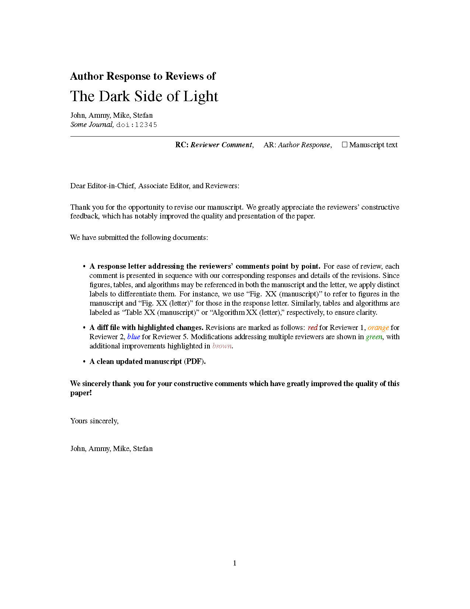

# Response Letters
Template for Latex to quickly write author response letters 

## Review Comments to a Manuscript

Use the examples in folder `RC_to_MS/`.

## Additional features

- supports latexdiff commands
- supports text highlighting with `\hl{}`
- supports tables and figures,
- supports non-labeled paragraphs, starting with `\AR*` or `\RC*` instead of `\AR` or `\RC`, respectively.

